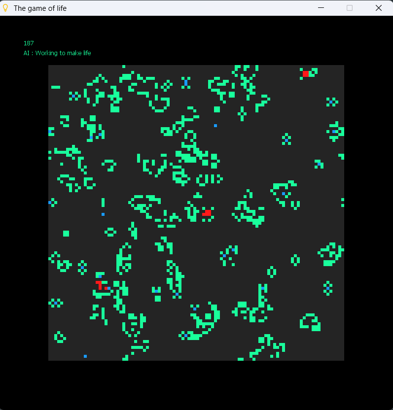

# Jogo da Vida

É um jogo desenvolvido utilizando a linguagem de progamação portugol, onde criei as regras do jogo inspirado no Conwey's game of life, utilizado para aqueles interessados em aprender mais sobre padrões que se repetem.

Para executar deve-se abaixar o Portugol Studio e dar upload do codigo.

Atualmente possuí os seguintes keybinds:

Q: Pausa o projeto e permite alterar os estados do pixel com os botões do mouse.
E: Randomiza o canvas do projeto, permitindo ver padrões se formando.
R: Limpa o canvas do projeto para testar padrões sem ter a interferência de outras células.

Segue uma imagem do codigo em execução:

